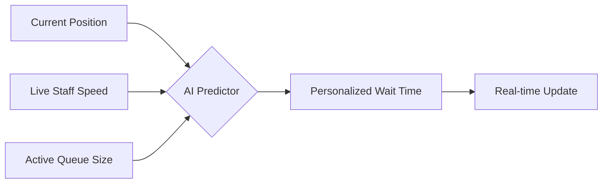

# 🚀 Queue Buddy: The SMART Queue Management System
### *Hackathon 2026 - Revolutionizing the Wait Experience*

---

## 😫 Slide 1: The Problem
> "The average person spends 2 years of their life waiting in lines."

### 🚩 The Pain Points:
- **Opacity**: Customers don't know *actually* how long they'll wait.
- **Inertia**: Staff are overwhelmed by manual token management.
- **Complexity**: Traditional systems are expensive and require hardware.
- **Frustration**: "Ghost" tokens and overbooked slots.

---

## 💡 Slide 2: The Solution - Queue Buddy
### *A Bridge Between Efficiency and Customer Satisfaction*

- **Platform-Agnostic**: Works on any device via a browser.
- **Data-Driven**: Real-time AI calculates wait times based on historical staff speed.
- **Geofenced**: Users must be "In Range" to take a ticket—preventing remote spam.
- **Interactive**: Live updates via high-performance WebSocket (Supabase Realtime).

---

## ✨ Slide 3: Key Innovation - AI Wait Engine
### *No more "10 minutes" that turns into 30.*

> [!TIP]
> **The Math**: Our engine uses dynamic recalculation every 30 seconds. If a staff member finishes a task early, the *entire* queue is notified instantly of their new, shorter wait time.

---

## 🎨 Slide 4: Premium UI/UX
### *Aesthetics matter in stress reduction.*

- **Glassmorphism Design**: Modern, transparent backgrounds with blurred surfaces.
- **Micro-Animations**: Pulse effects for AI predictions and smooth transitions.
- **Accessibility**: Clear, bold token numbers and high-contrast status badges.
- **Responsive**: Mobile-first architecture for the user on the move.

---

## 🛠 Slide 5: The Tech Stack
### *Built for Scale, Built for Speed.*

| Layer | Technology | Why? |
|-------|------------|------|
| **Frontend** | React / TypeScript | Speed, Safety, Component Architecture |
| **Realtime** | Supabase Realtime | Zero-latency state sync across users |
| **Database** | PostgreSQL | Robust relational data and RLS security |
| **Styling** | Tailwind CSS | JIT compilation for a fast, custom UI |
| **AI Logic** | Postgres RPC | Complex math executed closest to the data |

---

## 🔒 Slide 6: Security & Capacity
### *Trust is non-negotiable.*

- **Row Level Security (RLS)**: Users can only see *their* ticket data.
- **Geofencing**: GPS verification via Browser API ensures fair booking.
- **Daily Caps**: Staff set capacity limits to prevent system overloads.
- **Privacy**: Automatic name masking (e.g., "John Doe" → "J. Doe") for public displays.

---

## 🚀 Slide 7: Future Scope
### *Where we're going next.*

1. **AI Sentiment Analysis**: Notify users when staff are "in the zone" or when delays are expected.
2. **Predictive Scaling**: Recommend when more staff should open counters based on daily trends.
3. **Omni-channel Alerts**: WhatsApp/SMS integration for users away from the browser.
4. **Voice Feedback**: Audio cues for visually impaired users.

---

## 🏁 Slide 8: Summary
### *Queue Buddy makes waiting... worth it.*

✅ **Live & Sync'd**  
✅ **AI-Powered**  
✅ **Geofence-Protected**  
✅ **Beautifully Designed**  

---
#### *Thank You! Questions?*
**Project URL**: [View Demo](https://lovable.dev/projects/REPLACE_WITH_PROJECT_ID)
**Repo**: [GitHub: queue-buddy-main](https://github.com/your-repo/queue-buddy)
